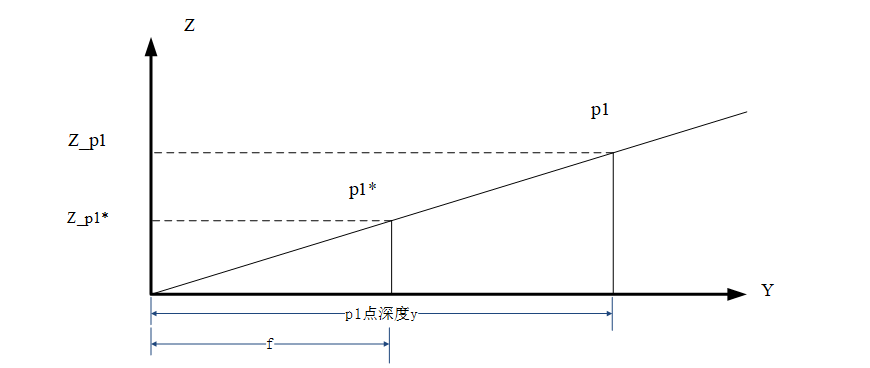

# Railway-line-angle-calculation
## 1.1 Problem introduction
- 设备
1.无人机
2.云台
3.相机
- 场景
**铁路轨道巡检**
- 系统要求
**无人机搭载云台控制可变焦相机拍摄清晰可靠的轨道线**
- 问题
**如何设置无人机与云台姿态控制相机获取合适轨道线图像**
## 1.2 Physical modeling

<h5 align ="center"><i>模型总体示意图</i></h5>

- **基本思想：在世界坐标系下使相机坐标系上的x轴方向与向量$P_{1}P_{2}$方向平行；从而达到轨道线成像平行于成像上下边缘。**
- 现在已知：
  相机焦距$f$；
  $p_{1},p_{2}$点在相机成像的相对坐标$\left ( u_{1},v_{1}\right )\left ( u_{2},v_{2}\right )$；
  相机与轨道平面距离（近似飞行器高度）$H$；
  云台当前姿态角$\left ( \alpha _{g},\beta _{g},\gamma _{g}\right )$；
  无人机当前姿态角$\left ( \alpha _{v},\beta _{v},\gamma _{v}\right )$；

- 求解：
1.求$x$轴方向向量在世界坐标系下坐标：因为x轴方向在相机坐标系下可取$x$轴方向单位向量$\left(1,0,0\right)$;
2.又因为相机坐标系与世界坐标系有如下变换关系（又因为此问题只涉及旋转运动可抛弃平移变换）：

世界坐标系下坐标到无人机坐标系下坐标是一个旋转变换（右手系）：$R_{x}\left ( \alpha \right )$表示绕X轴旋转的旋转矩阵（$R_{y}\left ( \alpha \right )$,$R_{z}\left (\alpha \right )$同理）

$$
R_{x}\left ( \alpha \right )=\begin{bmatrix}
 1&  0&  0& 0\\ 
 0&  cos\alpha&  -sin\alpha& 0\\ 
 0&  sin\alpha&  cos\alpha & 0\\ 
 0&  0&  0& 0
\end{bmatrix}
R_{y}\left ( \alpha \right )=\begin{bmatrix}
 cos\alpha&  0&  sin\alpha& 0\\ 
 0&  1&  0& 0\\ 
 -sin\alpha&  &  cos\alpha & 0\\ 
 0&  0&  0& 1
\end{bmatrix}
R_{z}\left ( \alpha \right )=\begin{bmatrix}
 cos\alpha&  -sin\alpha&  0& 0\\ 
 sin\alpha&  cos\alpha&  0& 0\\ 
 0&  0&  1& 0\\ 
 0&  0&  0& 1
\end{bmatrix}
$$
- 世界坐标系到无人机坐标系下的变换矩阵

$$R_{x}\left ( \alpha _{v}\right )R_{y}\left ( \beta _{v}\right )R_{z}\left ( \gamma _{v}\right )$$

- 无人机坐标系到云台坐标系下变换矩阵

$$R_{x}\left ( \alpha _{g}\right )R_{y}\left ( \beta _{g}\right )R_{z}\left ( \gamma _{g}\right )$$

$$\begin{bmatrix}
X_{w}\\ 
Y_{w}\\ 
Z_{w}\\
1
\end{bmatrix}为世界坐标系下坐标$$

$$\begin{bmatrix}
X_{c}\\ 
Y_{c}\\ 
Z_{c}\\
1
\end{bmatrix}为相机坐标系下坐标$$

- 忽略平移变换可得到相机坐标系下坐标到世界坐标系下的变换：

$$
\begin{bmatrix}
X_{w}\\ 
Y_{w}\\ 
Z_{w}\\
1
\end{bmatrix}=\left ( R_{x}\left ( \alpha _{v}\right )R_{y}\left ( \beta _{v}\right )R_{z}\left ( \gamma _{v}\right )*R_{x}\left ( \alpha _{g}\right )R_{y}\left ( \beta _{g}\right )R_{z}\left ( \gamma _{g}\right )\right )^{-1}*\begin{bmatrix}
X_{c}\\ 
Y_{c}\\ 
Z_{c}\\
1
\end{bmatrix}(1)
$$

## 2.1 Railway lines coordinates in the world coordinate system

- 下面求向量$\underset{P_{1}P_{2}}{\rightarrow}$在世界坐标系下的坐标。先将求$\underset{P_{1}P_{2}}{\rightarrow}$向量在相机坐标系下的坐标表示；所以要求$\underset{P_{1}P_{2}}{\rightarrow}$点在相机坐标系下的坐标。已知它们在成像平面的坐标$\left ( u_{1},v_{1}\right )\left ( u_{2},v_{2}\right )$，将它们变换到与相机坐标系下的$XOZ$面；

$$
\begin{bmatrix}
x_{c}\\ 
z_{c}\\ 
1
\end{bmatrix}=\begin{bmatrix}
1& 0& v_{o}\\ 
 0&  1&u_{o} \\ 
 0&  0& 1
\end{bmatrix}\begin{bmatrix}
u_{c}\\ 
v_{c}\\ 
1
\end{bmatrix}(2)
$$

$\begin{bmatrix}
x_{c}\\ 
z_{c}\\ 
1
\end{bmatrix}：相机坐标系下成像点坐标\begin{bmatrix}
u_{c}\\ 
v_{c}\\ 
1
\end{bmatrix}：原坐标系下坐标$
- 根据$P_{1}^{*}$坐标$\left(x_{c},z_{c}\right)$可求出,$P_{1}$在相机坐标系下$X、Z$方向的坐标，但需要$P_{1}$的深度信息

$$
\frac{Z_{P_{1}}}{Z_{P_{1}^{*}}}=\frac{Y_{p_{1}}}{f}\Rightarrow Z_{P_{1}}=\frac{Z_{P_{1}^{*}}*Y_{p_{1}}}{f}(3)
$$
## 2.2 Find the depth coordinates of point $P_{1}$

如图蓝色垂线$or$为光心垂直于成像平面并交于$p$点，同时交最远物平面于$r$点，$p$和$r$都为两成像平面视野范围的中心。轨道线平面内一条轨道为$WQ$，连接$OQ$交成像平面与$P$点，交最远物平面与$R$点，分别过$P、Q、R$做垂直于$Or$的垂线$Pp、Qq、Rr$。现在要求$Q$点深度即当$Qq$垂直于$Or$时$Oq$的长度。根据相似三角形有：$\frac{Oq}{Or}=\frac{OQ}{OR}$

这里假设相机没有做横滚运动：$CE//HI,WF//VJ,CW=EF$。可得梯形$CEFW$为等腰梯形。$过CE中点B,WF中点T做直线TB，TB交Or与K,过点O做OA垂直于TB延长线，CE⟂BT,CE//WF⟂Or,CE⟂平面OAK,CE⟂OA,OA⟂BT,OA⟂面CEFW。可得OB=\frac{OA}{\sin\angle AOB}，OC=\frac{OB}{\sin\angle COB}，OT=\frac{OA}{\sin \angle AOT},Or=OT*\cos\angle rOT,\frac{WT}{VU}=\frac{Or}{Op},$

- 这是图像的base64 

